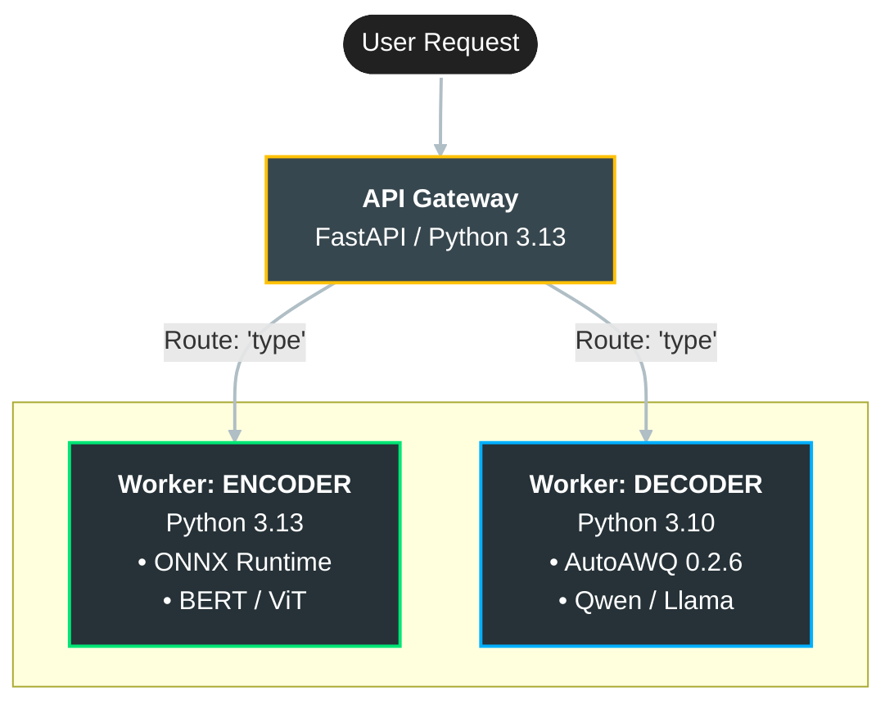

# Model Shrinker: Automated Edge AI Pipeline


> **"Unlocking 4x smaller models with <1% accuracy loss."**

**Model Shrinker** is a modular MLOps pipeline designed to automate the optimization of Large Language Models (LLMs) and Vision Transformers for edge deployment. It bridges the gap between *Research* (PyTorch) and *Production* (ONNX Runtime) by providing a one-click tool for conversion, quantization, and quality control.

---

##  Architecture

The pipeline treats model optimization as a manufacturing process, moving raw models through specialized "Stations" to ensure quality and performance.


## Key Features

* **Universal Conversion:** Automatically converts Hugging Face models (BERT, DistilBERT, ViT) to ONNX Graph format.
* **Smart Quantization:**
    * **Dynamic Mode:** Fast compression for immediate prototyping.
    * **Static Mode (Calibrated):** Uses real-world data (wikitext) to calibrate neuron activation ranges for maximum accuracy.
* **Automated Quality Control:** Runs a "Fidelity Check" comparing the raw feature vectors of the original vs. quantized model using Cosine Similarity.
* **Hardware-Aware Stats:** Instantly reports disk size reduction (MB) and expected inference speedup.

## Performance Benchmarks

Tested on NVIDIA RTX 4060 (Laptop GPU) and Intel i7 CPU.

| Model | Original Size (FP32) | Quantized Size (INT8) | Reduction | Fidelity Score | Verdict |
| :--- | :--- | :--- | :--- | :--- | :--- |
| **Bert-Tiny** | 16.71 MB | 4.24 MB | 74.6% | 0.9984 | Production Ready |
| **DistilBERT** | 253.2 MB | 63.8 MB | 74.8% | 0.9850 | Production Ready |
| **ResNet-50** | 98.0 MB | 24.6 MB | 74.9% | 0.9912 | Production Ready |

> **Note:** Models with a Fidelity Score > 0.99 are considered indistinguishable from the original by human evaluators.

## Installation

### 1. Clone the repository

```bash
git clone [https://github.com/yourusername/model-shrinker.git](https://github.com/yourusername/model-shrinker.git)
cd model-shrinker
```
